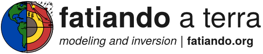
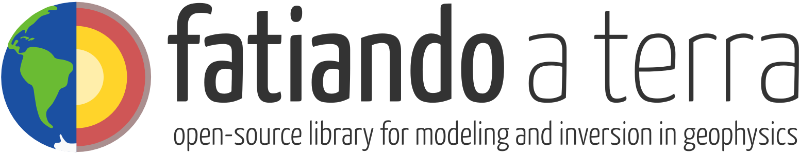

# Vector and raster files for The Fatiando a Terra logo

The logo was designed in [Inkscape](https://inkscape.org/en/). Use it to open
and edit the SVG files. There are also PNGs for use in websites, etc.

## The logo

`fatiando-logo.png`:

## Banners with "Fatiando a Terra" written on them

Useful for embedding in websites and presentations:

`fatiando-banner.png`:

`fatiando-banner-with-url.png`:

`fatiando-banner-homepage.png`:

## Wallpaper

A 1920 x 1080 sized wallpaper:

`fatiando-wallpaper.png`:

## License

All logo files are public domain
([CC0 1.0 Universal license](https://creativecommons.org/publicdomain/zero/1.0/)).
