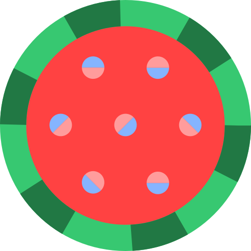

# Vector and raster files for The Fatiando a Terra logo

The logos were designed in [Inkscape](https://inkscape.org/en/). Use it to open
and edit the SVG files. There are also PNGs for use in presentations, etc.

## Logos

**Download all**:
[`logo-main.zip`](https://github.com/fatiando/logo/archive/main.zip)

| Name | Logo | Download |
|------|------|----------|
| Project logo |  | [PNG](https://github.com/fatiando/logo/raw/main/logos/fatiando-logo.png) / [SVG](https://github.com/fatiando/logo/raw/main/logos/fatiando-logo.svg) |
| Project logo (background) |  | [PNG](https://github.com/fatiando/logo/raw/main/logos/fatiando-logo-background.png) / [SVG](https://github.com/fatiando/logo/raw/main/logos/fatiando-logo-background.svg) |
| Pooch |  | [PNG](https://github.com/fatiando/logo/raw/main/logos/pooch-logo.png) / [SVG](https://github.com/fatiando/logo/raw/main/logos/pooch-logo.svg) |
| Verde |  | [PNG](https://github.com/fatiando/logo/raw/main/logos/verde-logo.png) / [SVG](https://github.com/fatiando/logo/raw/main/logos/verde-logo.svg) |
| Harmonica |  | [PNG](https://github.com/fatiando/logo/raw/main/logos/harmonica-logo.png) / [SVG](https://github.com/fatiando/logo/raw/main/logos/harmonica-logo.svg) |
| Boule |  | [PNG](https://github.com/fatiando/logo/raw/main/logos/boule-logo.png) / [SVG](https://github.com/fatiando/logo/raw/main/logos/boule-logo.svg) |
| Ensaio |  | [PNG](https://github.com/fatiando/logo/raw/main/logos/ensaio-logo.png) / [SVG](https://github.com/fatiando/logo/raw/main/logos/ensaio-logo.svg) |
| Choclo |  | [PNG](https://github.com/fatiando/logo/raw/main/logos/choclo-logo.png) / [SVG](https://github.com/fatiando/logo/raw/main/logos/choclo-logo.svg) |
| Magali |  | [PNG](https://github.com/fatiando/logo/raw/main/logos/magali-logo.png) / [SVG](https://github.com/fatiando/logo/raw/main/logos/magali-logo.svg) |

## Wallpaper

A 4k widescreen wallpaper: [`fatiando-wallpaper.png`](https://github.com/fatiando/logo/raw/main/fatiando-wallpaper.png)

## Other assets

`social`: Banners used for sharing on social media, our YouTube channel, etc.

`banner`: Banners for websites and presentations.

`assets`: SVG files with visual elements used to create some of the logos.

## License

All logo files are public domain
([CC0 1.0 Universal license](https://creativecommons.org/publicdomain/zero/1.0/)).
